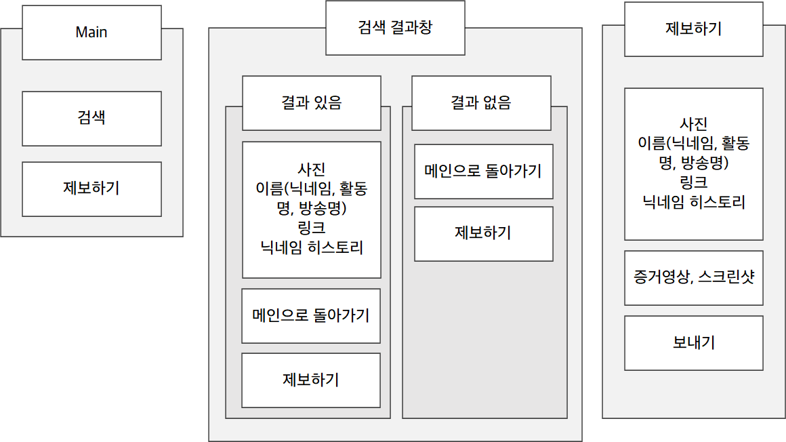
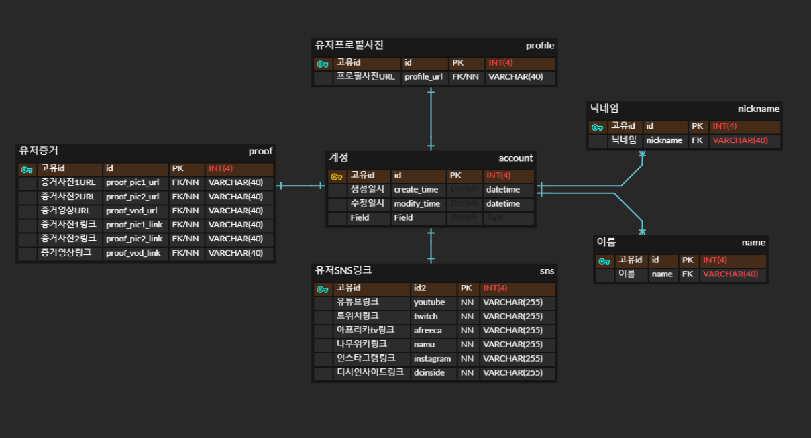
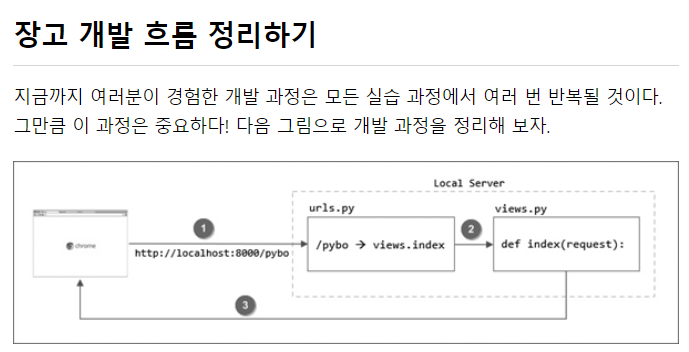

# hoxy.kr
롤 할 때 '혹시 이사람 유튜버인가?' 싶으면 검색할 수 있는 플랫폼  

## Introduction
롤을 할 때면 이사람이 유튜버, 혹은 셀럽인지 궁금해질 때가 있다.  
그럴 때 사용할 수 있는 검색 플랫폼을 만들어보자.  
- Start : 2021/06/20 ~  
- Participant : Just Me
- Project Managing : [노션 링크](https://www.notion.so/casselkim/HOXY-686358c4cac94619ae9af01d569646d2)  

## Process
### 기능 정의
- 사용자가 유명인들을 직접 신청할 수 있음 (증거 + 셀럽 정보 + 사이트)
- 입력되어있는 유명인들의 전적을 매일 추적
- 같이했던 플레이어의 전적과 비교해서 다르면 닉네임 업데이트
-   

### 스토리보드 작성
[카카오 오븐을 통한 스토리보드 작성](https://ovenapp.io/view/TPsALalvuPTjatV9Xe4Av7izp8rngkZL/Lynbr)  

### DB 설계
[erdcloud](https://www.erdcloud.com/)를 이용한 관계형 데이터베이스 다이어그램 작성 [참고 블로그](https://velog.io/@drrobot409/DataAnalyst3.-%EA%B4%80%EA%B3%84%ED%98%95-%EB%8D%B0%EC%9D%B4%ED%84%B0%EB%B2%A0%EC%9D%B4%EC%8A%A4%EC%99%80-%ED%85%8C%EC%9D%B4%EB%B8%94%EC%9D%98-%EC%9D%B4%ED%95%B4)  
  

### 장고 개발플로우

