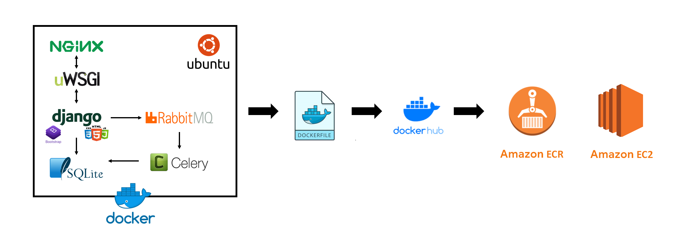
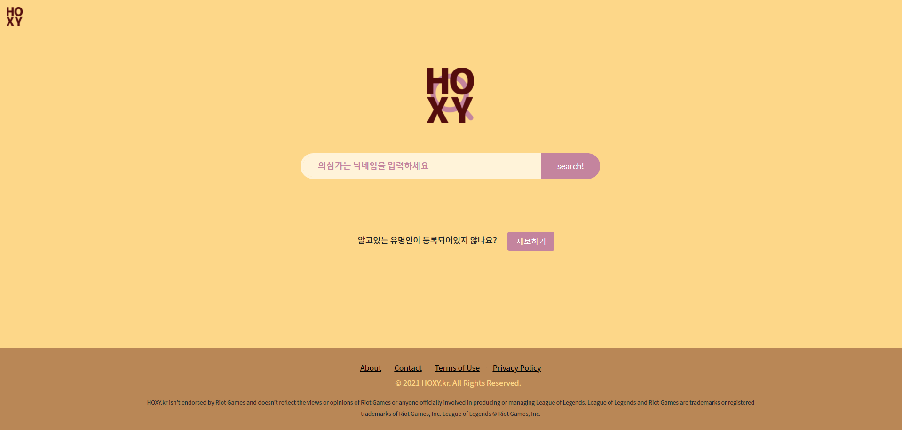

# hoxy.kr
롤을 할 때면 이사람이 유튜버, 혹은 셀럽인지 궁금해질 때가 있다.  
그럴 때 사용할 수 있는 검색 플랫폼을 만들어보자.  
- **Start** : 2021/06/20 ~  
- **Participant** : Just Me
- **Destination** : HTML, CSS, 장고, DB(설계), 퍼블리싱 입문 + 재미
- **Project Managing** : [노션 링크](https://www.notion.so/casselkim/HOXY-686358c4cac94619ae9af01d569646d2)  
- **Publishing**  

  - [도커](https://www.notion.so/casselkim/7154a622aa294505a88c99e60f8710c1)  
  - [AWS ECR에 Docker 올리기](https://casselkim.notion.site/AWS-ECR-Docker-b566ae679d9d4dd2b01d48d09194dcc1)  
  - [ECR에 올라간 이미지 EC2로 가져오기](https://www.notion.so/casselkim/ECR-EC2-542fd9b5c90b43adbfdcbf970f17ec65)  
  - [도커 컨테이너 만들고 장고 실행하기](https://www.notion.so/casselkim/ECR-EC2-542fd9b5c90b43adbfdcbf970f17ec65)  

## Architecture

## Environments
- Windows 10 Pro Edition
- VS Code v1.58
- Docker v20.10.7  
┣ Kitematic  
┣ Ubuntu 18.04.5  
┣ NGiNX  
┣ uWSGI  
┣ Celery  
┗ Rabbitmq  

## Requirements
- Python==3.6.9
- Django==1.8
- Pillow
- Requests

## Demo

